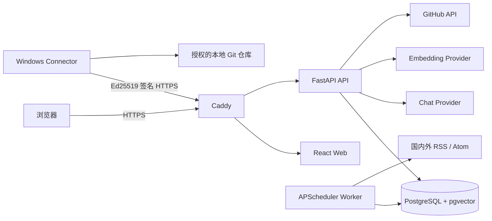

<div align="center">

# TechGrowth

**面向程序员的自托管 AI 技术成长智能体**

把技术情报、课程路线、每日任务、代码证据、Rubric 审阅和周复盘连接成一个可持续的成长闭环。

[](https://github.com/18624197712/techgrowth/actions/workflows/ci.yml)
[](https://github.com/18624197712/techgrowth/actions/workflows/security.yml)
[](https://www.python.org/)
[](https://react.dev/)
[](https://fastapi.tiangolo.com/)

[在线实例](https://www.hy20250221.online) · [完整技术文档](docs/technical-documentation.md) · [部署指南](docs/deployment.md) · [连接器说明](docs/connector.md) · [安全模型](docs/security.md)

</div>

## 项目简介

TechGrowth 是一个单用户、自托管的程序员成长平台。它不是单纯的 AI 聊天页面，而是让每天的学习都绑定明确课程节点、可执行任务和可审阅证据：

```text
技术雷达 + 课程进度 + 仓库证据
              ↓
       每日 30-45 分钟任务
              ↓
       成果提交与 Rubric 审阅
              ↓
       技能画像与课程进度更新
              ↓
             周复盘
```

系统已经部署在阿里云 ECS，可通过备案域名访问。在线实例是私人单用户环境，不提供公开注册。

## 核心功能

- **体系化课程路线**：支持 Java + Spring Cloud、Python + FastAPI/AI、Go、Node.js + TypeScript。
- **数据结构与算法副线**：按每周频率穿插复杂度、树图、搜索、动态规划等训练。
- **四阶段成长路径**：从基础、实战、生产逐步推进到架构阶段。
- **明确的每日任务**：包含理论、题目、约束、步骤、三级提示、解题思路、交付物、验收标准和 Rubric。
- **证据驱动晋级**：只有审阅通过的代码、Commit、答案、报告或测试结果才能推进技能等级。
- **每日技术雷达**：每天 08:00 抓取 12 个国内外技术来源，支持来源状态、去重、可信度和相关性排序。
- **上下文 AI 导师**：识别当前页面和学习意图，通过白名单 Function Calling 查询或操作平台功能。
- **安全写操作确认**：重新出题、切换路线、修改算法频率等操作必须由用户确认。
- **GitHub 与本地仓库**：支持私有仓库导入，以及出站式 Windows 托盘连接器。
- **可视化数据中台**：查看学习进度、雷达趋势、仓库指标和 AI 调用情况。
- **通知与复盘**：支持 SMTP、Web Push、审阅完成通知和每周成长复盘。
- **公网自托管**：Caddy 自动 HTTPS，Docker Compose 一键管理 API、Web、Worker 和 PostgreSQL。

## 界面结构

```text
┌──────────────┬──────────────────────────────────────┬──────────────────┐
│ 左侧导航     │ 中心工作区                           │ AI 上下文导师     │
│              │                                      │                  │
│ 今日任务     │ 任务、课程、雷达、仓库或数据图表     │ 流式对话          │
│ 数据中台     │                                      │ 工具调用结果      │
│ 课程中心     │ 当前页面的主要操作                   │ 写操作确认        │
│ 技术雷达     │                                      │                  │
│ 项目与仓库   │                                      │ 可拖动调整宽度    │
│ 成长证据     │                                      │                  │
│ 周复盘/设置  │                                      │ 输入框与发送按钮  │
└──────────────┴──────────────────────────────────────┴──────────────────┘
```

## 系统架构



系统采用模块化单体架构。API、Worker 和 Web 分容器运行，核心业务规则集中在 Python 领域服务中，适合个人项目维护，同时保留清晰的模块边界和事务一致性。

## 技术栈

| 领域 | 技术 |
| --- | --- |
| Web | React 19、TypeScript、Vite、Lucide、Recharts |
| API | Python 3.12、FastAPI、Pydantic、SQLAlchemy、Alembic |
| AI Agent | LangGraph、OpenAI-compatible API、Function Calling |
| 定时任务 | APScheduler、AsyncIO |
| 数据库 | PostgreSQL 16、pgvector |
| Windows 连接器 | PySide6、httpx、Ed25519、Keyring、PyInstaller |
| 网关与部署 | Caddy、Docker Compose、GHCR、GitHub Actions |
| 质量保障 | Pytest、Vitest、Testing Library、Ruff、ESLint、Trivy、Gitleaks |

## 仓库结构

```text
techgrowth/
├── apps/
│   ├── web/                 # React 工作台
│   └── connector/           # Windows 托盘连接器
├── services/
│   └── api/                 # FastAPI、Worker、Agent、领域服务和数据库模型
├── infra/
│   ├── Caddyfile            # HTTPS 与反向代理
│   └── scripts/             # 发布、备份、恢复和备份校验
├── docs/                    # 技术、部署、安全和连接器文档
├── .github/workflows/       # CI、发布、评测、安全扫描和连接器构建
├── compose.yaml
└── .env.example
```

## 快速开始

### 环境要求

- Python 3.12+
- Node.js 22+
- pnpm 10+
- Docker Engine 与 Docker Compose v2

### 1. 克隆仓库

```bash
git clone https://github.com/18624197712/techgrowth.git
cd techgrowth
```

### 2. 启动后端

```powershell
cd services/api
python -m pip install -e ".[dev]"
techgrowth create-admin --email you@example.com
uvicorn techgrowth_api.main:app --reload
```

默认开发数据库使用 SQLite。API 地址为 `http://127.0.0.1:8000`，OpenAPI 文档位于 `http://127.0.0.1:8000/docs`。

### 3. 启动 Web

```powershell
cd ../..
pnpm install --frozen-lockfile
pnpm --dir apps/web dev
```

浏览器访问 `http://127.0.0.1:5173`。首次登录需要绑定 TOTP。

### 4. 运行 Windows 连接器

```powershell
cd apps/connector
python -m pip install -e ".[dev]"
techgrowth-connector
```

在 Web 的“项目与仓库”页面创建一次性配对码，然后在连接器中填写服务地址、配对码和授权目录。

## 模型配置

Chat 与 Embedding 可以使用不同的 OpenAI 兼容服务、Base URL 和 API Key：

```dotenv
TG_CHAT_BASE_URL=https://chat-provider.example/v1
TG_CHAT_API_KEY=your-chat-key
TG_CHAT_MODEL=your-chat-model

TG_EMBEDDING_BASE_URL=https://embedding-provider.example/v1
TG_EMBEDDING_API_KEY=your-embedding-key
TG_EMBEDDING_MODEL=your-embedding-model
```

两个 Base URL 都必须包含 `/v1`。生产环境也可以登录后在设置页面保存配置；密钥会加密写入数据库，页面和 API 不返回密钥明文。

## Docker 部署

```bash
cp .env.example .env
# 编辑 .env，填写域名、数据库密码、独立密钥和模型配置

docker compose pull
docker compose run --rm api alembic upgrade head
docker compose up -d
docker compose run --rm api techgrowth create-admin --email you@example.com
docker compose ps
```

生产环境只应向公网开放 80/443，SSH 仅允许固定管理 IP，不要开放 PostgreSQL、API 或 Caddy 管理端口。完整步骤见 [部署指南](docs/deployment.md)。

## 定时任务

| 时间 | 任务 |
| --- | --- |
| 每天 08:00 | 抓取技术雷达 |
| 每天 08:10 | 在没有今日任务时生成任务 |
| 每周日 20:00 | 生成周复盘 |
| 每小时 | 清理过期加密临时文件 |

时区由 `TG_TIMEZONE` 控制，默认使用 `Asia/Shanghai`。

## 测试

```powershell
# API
cd services/api
$env:PYTHONPATH=(Join-Path (Get-Location) 'src')
python -m ruff check src tests
python -m pytest

# Web
cd ../..
pnpm --dir apps/web lint
pnpm --dir apps/web test
pnpm --dir apps/web build

# Connector
cd apps/connector
$env:QT_QPA_PLATFORM='offscreen'
python -m ruff check .
python -m pytest
```

CI 还会验证 PostgreSQL/pgvector 迁移、Windows 可执行文件构建、依赖审计、密钥泄漏和高危漏洞。

## 安全设计

- 单管理员账号，不开放注册。
- Argon2id 密码、强制 TOTP、恢复码、服务端 Session 和 CSRF 防护。
- 登录按邮箱与 IP 限流，关键操作写入安全审计日志。
- Chat、Embedding、GitHub、SMTP 和 Push 凭据独立加密保存。
- Windows 连接器使用一次性配对码和 Ed25519 请求签名，并防止 nonce 重放。
- 连接器遵守授权目录与 `.gitignore`，拒绝路径穿越、符号链接、密钥、二进制和超大文件。
- 模型输出必须通过 Pydantic Schema 和领域策略校验，模型不能直接提升技能等级。
- 通知、日志和导出不得包含代码或敏感凭据。

安全边界和事件处置说明见 [安全模型](docs/security.md)。

## 文档

| 文档 | 内容 |
| --- | --- |
| [完整技术文档](docs/technical-documentation.md) | 项目需求、架构、模块、数据模型、代码说明、测试、部署和 52 个 API |
| [部署指南](docs/deployment.md) | 阿里云 ECS、环境变量、发布、备份、恢复和验收 |
| [连接器说明](docs/connector.md) | Windows 配对、授权目录、同步、安全和卸载 |
| [安全模型](docs/security.md) | 认证、信任边界、密钥、临时文件和持续安全检查 |

## 项目状态与路线图

当前版本面向单用户个人部署，主要成长闭环已经可用。后续重点包括：

- 提升真实模型评测集和提示注入测试覆盖率。
- 完善关键公共类与方法的 docstring。
- 增加 Windows 代码签名和更清晰的升级通道。
- 增强仓库分析指标和课程节点的长期维护工具。
- 完善生产监控、告警和灾难恢复演练。

## 参与贡献

欢迎通过 Issue 提交问题、需求和技术来源建议。提交 Pull Request 前请运行 API、Web 和 Connector 对应测试，并确保不包含 `.env`、API Key、恢复码、私钥或用户代码。

## 许可证

当前仓库尚未声明开源许可证。公开可见不等于授予复制、修改或分发权限；在许可证确定前，请先联系仓库所有者获取授权。
