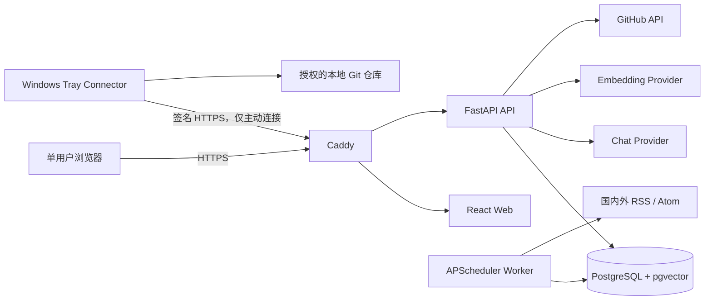
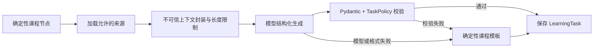

# TechGrowth 技术文档

> - 文档版本：v1.0
> - 业务代码基线：`92ba772fd0d70ac212eea8a859faa40167082c6b`
> - 更新日期：2026-08-02
> 生产域名：`https://www.hy20250221.online`

## 1. 项目概述

### 1.1 背景

TechGrowth 是面向个人程序员的单用户、自托管技术成长智能体。它解决的问题不是“再提供一个聊天机器人”，而是把持续学习变成一个有路线、有任务、有证据、有反馈的闭环，降低技术信息过载和无体系学习带来的时间浪费。

平台通过技术雷达、课程路线、仓库证据和 AI 导师形成以下闭环：

```text
技术情报 + 课程进度 + 仓库证据
              ↓
       每日 30-45 分钟任务
              ↓
       成果提交与 Rubric 审阅
              ↓
       技能证据与课程进度更新
              ↓
             周复盘
```

### 1.2 目标

- 每天只安排一个可在 30 至 45 分钟完成的明确任务。
- 支持 Java + Spring Cloud、Python + FastAPI/AI、Go、Node.js + TypeScript 四条主路线。
- 通过独立的数据结构与算法副线补充基础能力。
- 课程从基础、实战、生产逐步推进到架构阶段。
- 任务包含理论知识、题目、约束、执行步骤、三级提示、解题思路、交付物、验收标准和 Rubric。
- 技能晋级只接受审阅通过的代码、Commit、报告、答案或测试结果，AI 不能直接修改等级。
- 通过每日技术雷达保持对国内外技术变化的感知。
- 通过 Windows 连接器安全读取用户明确授权的本地仓库元数据和按需文件。
- 在中国大陆阿里云 ECS 上通过备案域名提供公网 HTTPS 服务。

### 1.3 当前成果

- 已上线 React 工作台、FastAPI API、定时 Worker、PostgreSQL/pgvector、Caddy 和 Windows 连接器。
- 已实现课程中心、今日任务、重新出题、三级提示、解题思路、成果审阅、技能画像、周复盘、技术雷达、仓库连接、数据中台和上下文导师。
- Chat 与 Embedding 支持不同 Base URL、模型和 API Key。
- 技术雷达每天 `08:00 Asia/Shanghai` 抓取，今日任务在 `08:10` 生成。
- 当前数据库迁移版本为 `0004 (head)`。
- API 当前包含 52 个对外端点。

### 1.4 非目标

- 不开放注册，不提供多人协作、社交、排行榜或移动 App。
- 不允许模型直接访问数据库、任意文件、凭据或任意 URL。
- 不自动执行、构建、安装或测试用户仓库代码。
- 不批量上传整个仓库，不上传密钥、二进制或超大文件。
- 首版 Windows 程序未签名，不静默自动安装更新。

## 2. 需求文档

### 2.1 用户角色

系统只有一个业务角色：管理员兼学习者。管理员由服务器 CLI 初始化，不存在公开注册流程。

### 2.2 核心用户需求

| 编号 | 需求 | 验收标准 |
| --- | --- | --- |
| R-01 | 选择技术路线和目标等级 | 路线切换保留历史进度；等级支持基础、实战、生产、架构 |
| R-02 | 获得体系化每日任务 | 每天最多一个有效任务，时长 30-45 分钟，并绑定当前课程节点 |
| R-03 | 重新出题 | 保持当前路线、阶段和能力目标，只改变题目场景；请求幂等 |
| R-04 | 获得分层帮助 | 三级提示逐步揭示，解题思路单独确认后展示 |
| R-05 | 用证据推进能力 | 提交成果后按 Rubric 审阅，只有通过证据可推进技能和节点 |
| R-06 | 跟踪技术资讯 | 每天 08:00 抓取，显示来源、发布日期、可信度和相关性 |
| R-07 | 连接 GitHub 与本地仓库 | GitHub PAT 加密保存；本地连接器只访问授权目录 |
| R-08 | 查看成长数据 | 数据中台提供学习、雷达、仓库和 AI 运行图表及指标解释 |
| R-09 | 与 AI 导师交互 | 支持技术问答、上下文理解、只读工具调用和写操作确认 |
| R-10 | 接收通知 | 每日任务、审阅完成和周复盘可分别配置邮件/Web Push |
| R-11 | 导出或删除数据 | 导出不包含密钥；删除要求显式确认并保留安全边界 |
| R-12 | 公网安全访问 | 备案域名 HTTPS；仅 80/443 对公网开放；数据库无公网端口 |

### 2.3 主要业务规则

1. 未通过任务的聚焦补做优先于新任务。
2. 算法任务按每周配置次数替代当天主路线任务，不额外增加任务量。
3. 普通任务 14 天内不重复主题；补做以及课程等级往返对齐场景例外。
4. 任务步骤总时长必须与 30 至 45 分钟目标一致。
5. 每个课程任务至少包含两个验收检查、一个关键 Rubric 项和完整 0-4 分锚点。
6. 重新出题将旧的未提交任务标记为 `replaced`，不计为学习失败。
7. 审阅平均分至少为 3，且关键项不得低于 2，才产生通过证据。
8. 模型输出必须通过 Pydantic Schema 和领域规则校验；失败时使用确定性课程模板回退。
9. 导师写操作必须生成确认提议，用户确认后才执行。
10. 通知不得包含代码、API Key、恢复码、文件路径或审阅敏感正文。

### 2.4 用户界面草图

```text
┌──────────────┬──────────────────────────────────────┬──────────────────┐
│ TechGrowth   │ 当前页面                              │ AI 上下文导师     │
│              │                                      │                  │
│ 今日任务     │ 课程路线 / 任务 / 图表 / 雷达列表     │ 对话消息          │
│ 数据中台     │                                      │ 工具执行结果      │
│ 课程中心     │ 页面主要操作                          │ 写操作确认/取消    │
│ 技术雷达     │                                      │                  │
│ 项目与仓库   │                                      │ 可拖动调整宽度     │
│ 成长证据     │                                      │                  │
│ 周复盘       │                                      │ 输入框 + 发送按钮 │
│ 设置         │                                      │                  │
└──────────────┴──────────────────────────────────────┴──────────────────┘
```

移动端将左侧导航压缩为工具栏，导师改为全屏抽屉。导师桌面宽度限制为 320-720px，并保存在浏览器本地。

### 2.5 页面功能

- **今日任务**：展示完整任务契约、来源、步骤、提示、解题思路、重新出题和成果提交。
- **数据中台**：展示统一总览、学习进度、雷达趋势、仓库质量和 AI 调用数据。
- **课程中心**：选择主路线、目标阶段和每周算法频率，查看节点进度。
- **技术雷达**：显示发布日期、来源、摘要、可信度、相关性、采集状态和手动刷新。
- **项目与仓库**：创建连接器配对码、查看本地仓库、导入 GitHub 私有仓库和匹配状态。
- **成长证据**：查看技能等级、证据数量、分数和仓库关联情况。
- **周复盘**：生成本周总结、证据引用和下一周重点。
- **设置**：分别配置 Chat/Embedding Provider、GitHub Token、通知偏好和 Web Push。

## 3. 设计文档

### 3.1 技术栈

| 层 | 技术 |
| --- | --- |
| Web | React 19、TypeScript 5.7、Vite 5、Lucide、Recharts |
| API | Python 3.12、FastAPI、Pydantic、SQLAlchemy 2、Alembic |
| Agent | LangGraph、OpenAI-compatible Chat/Embedding API、Function Calling |
| Worker | APScheduler、AsyncIO |
| 数据 | PostgreSQL 16、pgvector；测试环境兼容 SQLite/JSON 向量 |
| 边缘入口 | Caddy 2.10，自动 HTTPS、反向代理、压缩和访问日志轮转 |
| Windows 连接器 | Python 3.12、PySide6、httpx、Ed25519、Keyring、PyInstaller |
| CI/CD | GitHub Actions、GHCR、自托管 ECS Runner、Ruff、Pytest、Vitest、ESLint、Trivy、Gitleaks |

### 3.2 总体架构



系统采用模块化单体而不是微服务：API、Worker 和 Web 分容器部署，但核心业务规则仍在同一 Python 代码库中，便于单用户项目维护和事务一致性。

### 3.3 网络与信任边界

- 公网只暴露 Caddy 的 80/443。
- API、Web、Worker 和 PostgreSQL 不映射公网端口。
- PostgreSQL 位于 Docker internal 网络。
- Windows 连接器没有监听端口，服务器不能反向浏览用户电脑。
- 国内雷达源直连；可选代理只应用于国际雷达源，不承载模型、GitHub 或连接器凭据。
- 仓库内容、雷达内容、用户提交和模型输出全部按不可信输入处理。

### 3.4 后端模块

| 模块 | 主要职责 |
| --- | --- |
| `routers/auth.py` | 登录、TOTP 注册/验证、当前用户和退出 |
| `routers/growth.py` | 课程、任务、提示、提交、审阅、画像、雷达和周复盘查询 |
| `routers/connector.py` | 配对、签名请求、设备、仓库、任务和分块上传 |
| `routers/system.py` | SSE 聊天、工具确认、通知订阅、导出和删除 |
| `routers/settings.py` | Provider、GitHub Token 和通知配置 |
| `routers/analytics.py` | 数据中台五类聚合查询 |
| `services/curriculum.py` | 当前路线、目标阶段、算法频率、节点资格和进度 |
| `services/daily_tasks.py` | 今日任务生成、课程对齐、雷达转任务和重新出题 |
| `services/growth.py` | 任务持久化、提交、Rubric 审阅、证据和技能等级 |
| `services/radar_jobs.py` | 雷达采集作业、幂等、状态、Embedding 和运行记录 |
| `services/chat_context.py` | 按意图加载最小必要上下文 |
| `services/chat_actions.py` | 导师写操作提议、确认、过期和幂等执行 |
| `services/repositories.py` | Git Remote 规范化、GitHub/连接器仓库合并和匹配 |
| `services/analytics.py` | 从业务事实计算可解释指标 |
| `services/settings.py` | Provider 和 GitHub 凭据加密、掩码及优先级解析 |
| `services/connector.py` | Ed25519 设备、nonce、防重放、同步任务和上传记录 |
| `services/artifacts.py` | 加密临时文件、断点追加、读取、删除和超时清理 |
| `services/notifications.py` | SMTP、Web Push、偏好过滤和投递审计 |

### 3.5 Agent 工作流

任务生成通过 LangGraph 执行：



导师流程先识别意图，再选择上下文和白名单工具。只读工具可以自动执行；重新出题、切换路线、修改算法频率、雷达转任务和仓库同步等写操作必须通过确认接口。

### 3.6 课程体系

| 路线 | 重点 |
| --- | --- |
| Java + Spring Cloud | Java/Spring 核心、服务开发、中间件、稳定性、分布式架构治理 |
| Python + FastAPI/AI | Python/FastAPI、模型 API、RAG、Agent、评测、AI 平台架构 |
| Go | 语言与并发、网络服务、数据访问、性能、云原生和高并发架构 |
| Node.js + TypeScript | TypeScript/Node、API、事件、测试、性能、安全和平台化 |
| 数据结构与算法 | 复杂度、线性结构、树图、排序搜索、贪心、回溯、动态规划和工程算法 |

主路线具有 `foundation`、`practice`、`production`、`architecture` 四阶段。课程目录由版本化代码维护，模型只围绕确定节点出题，不能临时发明晋级路线。

### 3.7 技术雷达

当前默认来源共 12 个：

- 国际：OpenAI News、Hugging Face Blog、LangGraph Releases、OpenAI Agents SDK Releases、arXiv cs.AI/cs.CL、Hacker News。
- 国内：OSCHINA、InfoQ 中文、SegmentFault、V2EX 技术、阮一峰的网络日志、机器之心。

每个来源独立重试，候选 URL 可回退；单源失败不阻断其他来源。条目按规范化 URL 和来源键去重，保存发布时间、可信度、相关性、原因和 Embedding。

### 3.8 数据模型

| 聚合 | 主要表 |
| --- | --- |
| 身份与安全 | `users`、`auth_sessions`、`login_attempts`、`audit_logs` |
| 成长 | `skill_profiles`、`skill_evidence`、`curriculum_state` |
| 任务 | `learning_tasks`、`submissions`、`reviews`、`weekly_reviews` |
| 雷达与 Agent | `radar_items`、`agent_runs`、`agent_actions` |
| 连接器 | `pairing_codes`、`connector_devices`、`connector_nonces`、`sync_jobs`、`upload_artifacts` |
| 仓库 | `repositories` |
| 配置与通知 | `app_settings`、`notification_preferences`、`push_subscriptions`、`notification_deliveries` |

敏感字段以应用层加密形式保存；密码使用 Argon2id；Session、CSRF、设备 Token 和恢复码只保存哈希。

### 3.9 定时任务

| 时间 | 任务 |
| --- | --- |
| 每天 08:00 | 抓取技术雷达 |
| 每天 08:10 | 在没有今日任务时生成课程任务并通知 |
| 每周日 20:00 | 生成周复盘并通知 |
| 每小时 | 清理超过有效期的加密临时文件 |

所有时间使用 `TG_TIMEZONE`，生产默认 `Asia/Shanghai`。作业启用合并补跑、单实例执行和幂等保护。

## 4. 代码文档

### 4.1 关键类和方法

| 类/函数 | 关键方法 | 契约 |
| --- | --- | --- |
| `ServiceContainer` | `build()` | 创建所有领域服务并统一注入数据库、配置和加密依赖 |
| `CurriculumService` | `state()`、`switch_track()`、`set_target_stage()`、`next_node()` | 管理唯一课程状态并确定下一节点 |
| `DailyTaskService` | `generate()`、`generate_from_radar()`、`regenerate()` | 生成或替换任务，维持每日唯一任务和幂等链 |
| `GrowthService` | `save_draft()`、`replace_task()`、`submit()`、`review()` | 保存任务、提交成果、审阅并生成成长证据 |
| `TaskPolicy` | `validate()` | 校验时长、主题去重、任务完整性、提示、验收和 Rubric |
| `EvidencePolicy` | `review_passes()`、`level_for()` | 使用确定规则判定审阅通过和技能等级 |
| `AgentWorkflowService` | `generate_daily_task()` | 运行 LangGraph、结构化模型输出和规则模板回退 |
| `ChatContextService` | `build()` | 按意图加载任务、提交、成长或雷达上下文 |
| `ChatActionService` | `propose()`、`confirm()`、`cancel()` | 对导师写操作执行确认、过期与幂等控制 |
| `RadarCollector` | `collect()`、`proxy_for()` | 并发采集来源并隔离国内直连与国际代理 |
| `RadarJobService` | `run()`、`status()` | 执行每日幂等采集、Embedding 和运行审计 |
| `RepositoryService` | 仓库注册、导入与合并方法 | 通过 Provider ID、规范 Remote 或本地指纹识别同一仓库 |
| `ConnectorService` | 配对、验签、任务与上传方法 | 管理 Ed25519 设备和按需同步生命周期 |
| `TempArtifactStore` | `append()`、`read()`、`delete()`、`cleanup()` | 加密保存分块内容并按偏移续传与过期清理 |
| `AnalyticsService` | 五类查询方法 | 返回指标定义、数值和构成事实，不维护不可解释总分 |
| `SettingsService` | `save_provider()`、`provider_values()`、`provider_status()` | 加密配置 Chat/Embedding 并按字段解析优先级 |
| `AuthService` | 管理员、登录、TOTP、Session 方法 | 实现单用户身份、限流、恢复码和安全审计 |
| `build_scheduler()` | 注册四类作业 | 固化雷达、任务、周复盘和清理调度 |
| Web `api()` | 通用请求封装 | 自动携带 Cookie、CSRF，并把服务端错误转为中文可显示错误 |
| Web `streamChat()` | SSE 消费 | 解析 intent、token、tool_call、tool_result 和 action_proposal |
| `CurriculumCenter` | `switchTrack()`、`setTargetStage()` | 修改课程状态并触发今日任务重新对齐 |
| `ChatDrawer` | `submit()`、`confirm()`、`resize()` | 流式导师、写操作确认和可持久化宽度 |

### 4.2 文档注释规范

当前代码主要依靠类型标注、Pydantic Schema、测试和清晰命名表达契约，关键公共类的 docstring 覆盖仍不完整。后续修改关键类或公共方法时应同步补充简短 docstring，至少说明：

1. 方法承担的业务职责，而不是重复函数名。
2. 参数的业务含义、允许范围和敏感性。
3. 返回值和持久化副作用。
4. 可能抛出的领域错误及调用方处理方式。
5. 幂等、事务、权限或安全约束。

不应在注释中写入真实域名凭据、API Key、恢复码、生产数据库信息或用户代码。

## 5. 测试计划

### 5.1 测试层级

| 层级 | 工具 | 重点 |
| --- | --- | --- |
| Python 单元测试 | Pytest | 课程选择、证据晋级、TaskPolicy、路径安全、签名和 token 限额 |
| API 集成测试 | FastAPI TestClient、SQLite/PostgreSQL | 身份、CSRF、任务闭环、雷达、GitHub、连接器和通知 |
| Web 组件测试 | Vitest、Testing Library | 登录、工作台、课程切换、重新出题、提示、导师和 Push |
| Windows 连接器测试 | Pytest、offscreen Qt | 授权目录、扫描过滤、离线队列、签名、配对和续传 |
| 数据库迁移测试 | Alembic + pgvector PostgreSQL | 从已有版本升级到 head，验证向后兼容 |
| 模型评测 | 固定评测集 | Schema、引用、安全拒绝、任务约束和 Rubric 覆盖 |
| 生产验收 | HTTPS + Docker + 实际工作流 | 容器健康、课程往返、备份恢复、失败回滚和公网入口 |

### 5.2 必测场景

- 基础 → 实战 → 基础等级往返，今日任务能够重新对齐且不触发 14 天误拦截。
- 主路线切换保留其他路线进度，算法路线不能设为主路线。
- 重新出题保持课程节点、支持幂等且不能替换已提交任务。
- 提示和解题思路默认隐藏，揭示操作被记录。
- 模型配置缺失、鉴权失败、格式错误和不支持 JSON Schema 时安全回退。
- Chat 与 Embedding 使用独立 Provider，单侧缺失不阻断另一侧。
- 雷达单源失败、代理失败、候选 URL 回退和每日补跑。
- GitHub SSH/HTTPS Remote 规范化并与连接器仓库合并。
- 连接器拒绝路径穿越、符号链接、密钥、依赖目录、二进制和超限文件。
- 登录限流、TOTP、CSRF、Session 撤销、nonce 重放和设备撤销。
- 通知、日志、导出和模型上下文中不泄漏敏感数据。

### 5.3 CI 质量门禁

`main` 推送和 Pull Request 执行：

- 后端：Ruff、Pytest、PostgreSQL 迁移。
- Web：ESLint、Vitest、TypeScript/Vite 构建。
- Connector：Ruff、Pytest、PyInstaller 和 SHA-256 产物。
- 安全：Gitleaks、Trivy、pip-audit、pnpm audit。
- 模型评测：每天 UTC 18:00，即北京时间次日 02:00；每日 token 上限 50,000。

模型评测目标：Schema、引用和安全拒绝有效率 100%，任务约束与 Rubric 覆盖率至少 95%。

### 5.4 本地测试命令

```powershell
# API
cd services/api
python -m pip install -e ".[dev]"
$env:PYTHONPATH=(Join-Path (Get-Location) 'src')
python -m ruff check src tests
python -m pytest

# Web
cd ../..
pnpm install --frozen-lockfile
pnpm --dir apps/web lint
pnpm --dir apps/web test
pnpm --dir apps/web build

# Windows Connector
cd apps/connector
python -m pip install -e ".[dev]"
$env:QT_QPA_PLATFORM='offscreen'
python -m ruff check .
python -m pytest
```

## 6. 部署指南

### 6.1 生产拓扑

ECS 通过 Docker Compose 运行 `caddy`、`web`、`api`、`worker` 和 `db`。镜像使用完整 Git SHA 标签。生产目录为 `/opt/techgrowth`。

### 6.2 前置条件

- Ubuntu 22.04/24.04，至少建议 2 vCPU、4 GB RAM、40 GB 云盘。
- 已备案域名的 A/AAAA 记录指向 ECS。
- 安全组只开放 TCP 80/443；SSH 22 仅允许固定管理 IP。
- 已安装 Docker Engine 和 Compose v2。
- ECS 能访问所需镜像仓库；如果 GHCR 受限，应使用合规镜像同步方案。

### 6.3 配置

```bash
cd /opt/techgrowth
cp .env.example .env
chmod 600 .env
mkdir -p logs/caddy backups
chmod 700 backups
chmod +x infra/scripts/*.sh
```

必须配置：

- `APP_DOMAIN`、`ACME_EMAIL`、`TG_ICP_NUMBER`
- `POSTGRES_DB`、`POSTGRES_USER`、`POSTGRES_PASSWORD`
- `TG_SECRET_KEY`、`TG_ENCRYPTION_KEY`
- `API_IMAGE`、`WEB_IMAGE`、`IMAGE_TAG`
- `TG_CHAT_BASE_URL`、`TG_CHAT_API_KEY`、`TG_CHAT_MODEL`
- `TG_EMBEDDING_BASE_URL`、`TG_EMBEDDING_API_KEY`、`TG_EMBEDDING_MODEL`

两个 Base URL 都必须包含 `/v1`。Chat 与 Embedding 的 Key 独立加密保存。`TG_ENCRYPTION_KEY` 丢失将导致 TOTP、Provider、GitHub 和通知凭据无法解密，必须纳入服务器密钥备份。

### 6.4 首次启动

```bash
docker compose pull
docker compose run --rm api alembic upgrade head
docker compose up -d
docker compose run --rm api techgrowth create-admin --email you@example.com
docker compose ps
curl -fsS "https://$APP_DOMAIN/api/v1/health"
```

首次登录必须绑定 TOTP，并立即离线保存恢复码。

### 6.5 正式发布

GitHub Actions 将 API 和 Web 镜像以完整 Git SHA 推送至 GHCR，自托管 ECS Runner 仅部署受保护 `main` 分支：

```bash
cd /opt/techgrowth
./infra/scripts/deploy.sh <40位Git-SHA>
```

发布脚本执行顺序：数据库备份 → 切换镜像标签 → 拉取镜像 → Alembic 迁移 → 启动容器 → 内部 API 健康检查 → 公网 HTTPS 健康检查。失败时恢复上一镜像标签。

运维脚本中如果先 `source .env` 再修改 `IMAGE_TAG`，必须同步 `export IMAGE_TAG=<new-sha>`；Shell 环境变量优先于 `--env-file`，否则 Compose 可能继续启动旧镜像。

### 6.6 备份与恢复

建议计划任务：

```cron
15 3 * * * cd /opt/techgrowth && ./infra/scripts/backup.sh >> logs/backup.log 2>&1
0 4 2 * * cd /opt/techgrowth && ./infra/scripts/verify-backup.sh >> logs/restore-check.log 2>&1
```

保留 7 个日备份、4 个周备份和 6 个月备份。恢复会重建目标数据库，必须显式确认：

```bash
./infra/scripts/restore.sh /opt/techgrowth/backups/daily/techgrowth-YYYY.dump --confirm
```

同时配置阿里云每日云盘快照并保留 7 天。数据库逻辑备份和云盘快照用途不同，不能互相替代。

### 6.7 日常维护

```bash
docker compose ps
docker compose logs --since 30m api worker caddy
docker compose exec -T api alembic current
curl -fsS https://www.hy20250221.online/api/v1/health
```

应监控容器健康、磁盘、内存、证书续期、雷达来源失败率、模型调用失败率、通知投递失败和备份完整性。不得在日志、工单或聊天中粘贴 `.env`、恢复码或用户代码。

## 7. API 文档

### 7.1 通用约定

- Base URL：`https://www.hy20250221.online/api/v1`
- 内容类型：除上传分块外使用 `application/json`。
- 浏览器认证：服务端 Session Cookie；写接口额外要求 `X-CSRF-Token`。
- 连接器认证：设备 Token + Ed25519 签名，签名覆盖方法、路径、时间戳、nonce 和请求体 SHA-256。
- 错误：使用 HTTP 状态码和安全的错误详情，不返回密钥、底层响应正文或敏感堆栈。
- 在线交互式规范：`/docs`；OpenAPI JSON：`/openapi.json`。生产是否公开这两个路径由边缘配置决定。

### 7.2 身份认证

| 方法 | 路径 | 说明 |
| --- | --- | --- |
| POST | `/auth/login` | 密码登录；首次进入 TOTP 注册态 |
| GET | `/auth/totp/setup` | 获取当前管理员 TOTP 注册信息 |
| POST | `/auth/totp/confirm` | 确认首次 TOTP 并签发完整 Session/CSRF |
| POST | `/auth/totp/verify` | 验证已绑定 TOTP |
| GET | `/auth/me` | 获取当前用户 |
| POST | `/auth/logout` | 撤销当前 Session |

### 7.3 课程、任务与成长

| 方法 | 路径 | 说明 |
| --- | --- | --- |
| GET | `/curriculum` | 获取课程目录、当前路线、阶段、算法频率和进度 |
| PUT | `/curriculum/active-track` | 切换 Java/Python/Go/Node 主路线 |
| PUT | `/curriculum/target-stage` | 设置 foundation/practice/production/architecture |
| PUT | `/curriculum/algorithm-frequency` | 设置每周 0-7 次算法任务 |
| POST | `/tasks/generate` | 按当前课程状态生成任务 |
| GET | `/tasks/today` | 获取或自动对齐今日有效任务 |
| POST | `/tasks/{task_id}/regenerate` | 在当前节点重新出题；支持幂等键 |
| POST | `/tasks/{task_id}/hints/{level}/reveal` | 揭示 1-3 级提示 |
| POST | `/tasks/{task_id}/solution/reveal` | 确认后揭示解题思路 |
| POST | `/tasks/{task_id}/submissions` | 提交 Commit、报告、答案或测试证据并触发审阅 |
| GET | `/reviews/{submission_id}` | 获取 Rubric 审阅结果 |
| GET | `/profile` | 获取证据支持的技能画像 |
| GET | `/weekly-reviews` | 获取周复盘历史 |
| POST | `/weekly-reviews/generate` | 手动生成周复盘 |

### 7.4 技术雷达与数据中台

| 方法 | 路径 | 说明 |
| --- | --- | --- |
| GET | `/radar` | 获取按时间、可信度和相关性排序的雷达条目 |
| GET | `/radar/status` | 获取最近采集运行与来源成功/失败状态 |
| POST | `/radar/refresh` | 手动触发一次雷达采集 |
| GET | `/analytics/overview` | 获取统一总览 |
| GET | `/analytics/learning` | 获取学习时间、任务和课程进度数据 |
| GET | `/analytics/radar` | 获取雷达趋势与来源数据 |
| GET | `/analytics/repositories` | 获取仓库语言、活跃度和质量指标 |
| GET | `/analytics/ai-runs` | 获取模型工作流成功率和 token 使用 |

Analytics 接口支持 `range=7d|30d|90d|all`，返回指标定义、值、趋势和构成数据。

### 7.5 AI 导师

| 方法 | 路径 | 说明 |
| --- | --- | --- |
| POST | `/chat/stream` | 返回 SSE：意图、文本 token、工具调用、结果和写操作提议 |
| POST | `/chat/actions/{action_id}/confirm` | 确认并执行待处理写操作 |
| POST | `/chat/actions/{action_id}/cancel` | 取消待处理写操作 |

支持的白名单工具包括课程、技能差距、今日任务、雷达摘要、仓库指标、成长证据查询，以及重新出题、切换路线、算法频率、雷达转任务和仓库同步提议。

### 7.6 仓库与 Windows 连接器

| 方法 | 路径 | 说明 |
| --- | --- | --- |
| GET | `/repositories` | 获取 GitHub 与连接器统一仓库列表 |
| POST | `/repositories/github/import` | 使用已保存 PAT 导入 GitHub 私有仓库 |
| POST | `/connectors/pairing-codes` | 创建 10 分钟有效的一次性配对码 |
| DELETE | `/connectors/{device_id}` | 撤销设备和后续访问 |
| POST | `/connectors/{device_id}/jobs` | 管理员创建按需同步任务 |
| POST | `/connector/pair` | 连接器提交配对码和 Ed25519 公钥 |
| POST | `/connector/heartbeat` | 连接器心跳 |
| GET | `/connector/jobs` | 获取待执行同步任务 |
| POST | `/connector/jobs/{job_id}/complete` | 幂等完成同步任务 |
| POST | `/connector/repositories` | 上报仓库元数据和规范化 Remote |
| PUT | `/connector/uploads/{job_id}/{artifact_id}` | 按偏移上传单个授权文件分块 |
| POST | `/connector/uploads/{job_id}/{artifact_id}/complete` | 校验文件大小和 SHA-256 后完成上传 |

注意：当前实现路径是 `/connector/*`，不是早期规划中的 `/connector/v1/*`。

### 7.7 配置、通知和数据治理

| 方法 | 路径 | 说明 |
| --- | --- | --- |
| GET | `/setup` | 返回 Provider、GitHub、VAPID 等配置状态，不返回密钥明文 |
| PUT | `/setup/provider` | 分别保存 Chat 与 Embedding 配置 |
| PUT | `/setup/github` | 验证并加密保存 GitHub Fine-grained PAT |
| GET | `/notifications/preferences` | 获取通知偏好 |
| PUT | `/notifications/preferences` | 保存事件/渠道开关 |
| POST | `/notifications/push-subscriptions` | 加密保存浏览器 Push Subscription |
| GET | `/export` | 导出成长数据，不导出凭据和敏感正文 |
| DELETE | `/data` | 显式确认后删除成长数据 |
| GET | `/health` | 无需认证的服务健康检查 |

## 8. 文档维护

- 业务行为改变时，同一提交更新本文件对应章节。
- 新增或删除 API 后重新生成 `apps/web/src/generated/openapi.ts`，并更新第 7 节。
- 新增迁移时更新数据库版本和数据模型表。
- 调度、来源或部署脚本变化时更新运行手册。
- 文档中的“已实现”必须能够由代码、测试或生产验证证明；未来规划应单独标注。
